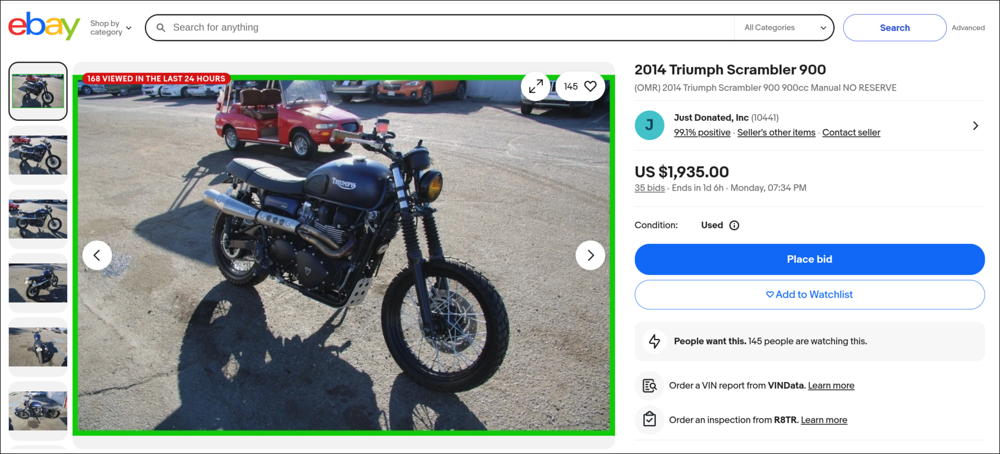

# MotoPricePredictor

## Problem Overview

This project focuses on predicting the market price of motorcycles using historical listing data from eBay. Accurately estimating motorcycle prices is useful for both buyers and sellers — buyers can identify overpriced listings, while sellers can price their vehicles competitively based on market trends.

Motorcycle prices depend on multiple factors including brand, engine size, mileage, year of manufacture, and condition. The objective of this project is to build a machine learning model that learns these relationships and produces reliable price predictions.

### The Dataset

The dataset used in this project was sourced from Kaggle, containing motorcycle listings scraped from eBay.

https://www.kaggle.com/datasets/dan195/ebaymotorcycles/data

The dataset is stored locally to ensure full reproducibility.

### Project Approach

To summarise the steps taken in this project:
- EDA: Explore the dataset, the feature and class distribution and discover feature importance
- Model building and finetuning: Testing and finetuning different models such as Linear Regression, Random Forest Regressor and XGBoost Regressor to find the best model
- Serialisng the model using pickle to be later deployed
- FastAPI Service: Serve predictions following the pipeline product of best model
- Containerisation of FastAPI Service: To allow for easy deployment.
- Deployment to AWS Lambda

### Project Structure

To understand how this project is organised, please find a breakdown of how this repository is structured [here](./assets/file_structure.md).